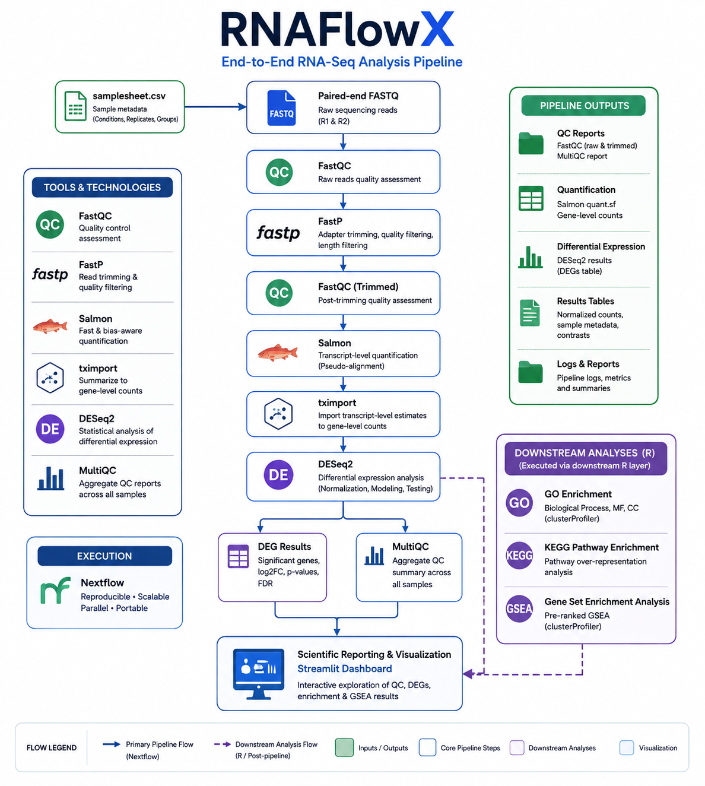

# RNAFlowX

## Reproducible Bulk RNA-seq Analysis & Workflow Engineering Platform

RNAFlowX is a modular bulk RNA-sequencing analysis platform built with **Nextflow DSL2**.

It combines bioinformatics analysis with reproducible workflow engineering, containerization, automated testing, CI/CD, execution monitoring, benchmarking, scientific reporting, and an interactive Streamlit dashboard.

---

## Overview

RNAFlowX processes paired-end bulk RNA-seq data through:

```text
Paired-end FASTQ
       │
       ▼
   FastQC (Raw)
       │
       ▼
     FastP
       │
       ▼
 FastQC (Trimmed)
       │
       ▼
     Salmon
       │
       ▼
    tximport
       │
       ▼
     DESeq2
       │
       ├──────────────► MultiQC
       │
       ▼
Differential Expression
       │
       ▼
 GO / KEGG / GSEA
       │
       ▼
Reports + SQLite + Streamlit Dashboard
```

The core sequencing workflow is orchestrated with Nextflow DSL2.

GO, KEGG, and GSEA are currently implemented through the downstream R analysis layer and are not yet native Nextflow processes.

---

## RNAFlowX at a Glance

### Workflow Architecture

<p align="center">
  
</p>

---

## Key Features

### Bioinformatics

- Raw-read FastQC
- FastP adapter trimming and quality filtering
- Post-trimming FastQC
- Salmon transcript quantification
- tximport transcript-to-gene aggregation
- DESeq2 differential-expression analysis
- PCA visualization
- MA plot
- Volcano plot
- GO enrichment
- KEGG pathway enrichment
- Gene Set Enrichment Analysis (GSEA)
- MultiQC reporting

### Workflow Engineering

- Nextflow DSL2
- Modular processes and workflows
- Local execution profile
- Docker execution profile
- SLURM/HPC-ready profile
- Azure Batch-ready configuration
- Kubernetes container validation
- GitHub Actions CI/CD
- Automated pytest validation
- Execution tracing and monitoring
- Reproducible benchmarking
- Environment provenance capture
- Nextflow caching and resume support

### Data & Presentation

- SQLite analytical data layer
- Multi-page Streamlit dashboard
- Quarto reporting
- R Markdown reporting
- Machine-readable CSV outputs

---

## Experimental Design

RNAFlowX uses a deliberately constrained public human bulk RNA-seq dataset to support complete execution on modest local hardware.

| Property | Value |
|---|---|
| GEO Series | GSE342612 |
| BioProject | PRJNA1508658 |
| Organism | *Homo sapiens* |
| Cell Model | HMC3 human microglial cells |
| Platform | Illumina NextSeq 550 |
| Library Layout | Paired-end |
| Assay | RNA-seq |
| Comparison | Vehicle control vs 50 µM PFOS |
| Exposure | 24 hours |
| Biological Samples | 4 |

### Selected Samples

| Group | Sample | SRA Run |
|---|---|---|
| Control | `control_rep1` | SRR40038349 |
| Control | `control_rep2` | SRR40038350 |
| PFOS 50 µM | `pfos50_rep1` | SRR40038343 |
| PFOS 50 µM | `pfos50_rep2` | SRR40038344 |

Total compressed sequencing input is approximately **308 MB**.

See [`docs/dataset.md`](docs/dataset.md) for complete dataset documentation.

---

## Technology Stack

| Layer | Technology |
|---|---|
| Workflow orchestration | Nextflow DSL2 |
| Quality control | FastQC, MultiQC |
| Preprocessing | FastP |
| Quantification | Salmon |
| Gene aggregation | tximport |
| Differential expression | DESeq2 |
| Functional analysis | clusterProfiler, GO, KEGG, GSEA |
| Statistical programming | R |
| Data processing | Python, Pandas |
| Analytical database | SQLite |
| Dashboard | Streamlit, Plotly |
| Scientific reporting | Quarto, R Markdown |
| Containers | Docker |
| HPC configuration | SLURM |
| Cloud-ready configuration | Azure Batch |
| Container orchestration demo | Kubernetes / kind |
| CI/CD | GitHub Actions |
| Testing | pytest |
| Version control | Git / GitHub |

---

## Repository Architecture

```text
RNAFlowX/
│
├── main.nf
├── nextflow.config
│
├── workflows/
│   ├── rnaseq.nf
│   ├── qc.nf
│   ├── quantification.nf
│   └── counting.nf
│
├── modules/
│   ├── qc/
│   ├── preprocessing/
│   ├── quantification/
│   ├── counting/
│   ├── differential_expression/
│   └── reporting/
│
├── bin/
│   ├── run_tximport.R
│   ├── run_deseq2.R
│   └── run_enrichment.R
│
├── conf/
│   ├── params.config
│   ├── base.config
│   ├── local.config
│   ├── docker.config
│   ├── slurm.config
│   └── azure.config
│
├── containers/
│   └── Dockerfile
│
├── kubernetes/
│   └── rnaflowx-demo.yaml
│
├── scripts/
│   ├── build_database.py
│   ├── benchmark.sh
│   └── summarize_benchmark.py
│
├── benchmark/
│   ├── environment/
│   ├── runs/
│   └── summaries/
│
├── streamlit_app/
│   ├── app.py
│   ├── pages/
│   ├── components/
│   ├── utils/
│   └── assets/
│
├── reports/
│
├── docs/
│
├── tests/
│   └── test_project.py
│
├── assets/
│   └── samplesheet.csv
│
├── .github/
│   └── workflows/
│       └── ci.yml
│
├── LICENSE
└── CITATION.cff
```

---

## Workflow

### 1. Input

RNAFlowX reads paired-end FASTQ information from:

```text
assets/samplesheet.csv
```

Experimental metadata are maintained separately in:

```text
data/metadata.csv
```

### 2. Raw Quality Control

FastQC evaluates sequencing quality before preprocessing.

### 3. Preprocessing

FastP performs adapter removal and quality filtering.

### 4. Post-trimming Quality Control

FastQC evaluates the cleaned reads after preprocessing.

### 5. Transcript Quantification

Salmon performs alignment-free transcript abundance estimation using a pre-built transcriptome index.

### 6. Gene-Level Aggregation

tximport converts transcript-level Salmon estimates into gene-level counts.

### 7. Differential Expression

DESeq2 performs differential-expression analysis.

Generated outputs include:

- complete differential-expression results
- significant-gene results
- normalized counts
- PCA
- MA plot
- volcano plot
- DESeq2 object
- analysis summary

### 8. Quality Reporting

MultiQC consolidates QC information from the workflow into a unified report.

### 9. Functional Analysis

The downstream R analysis layer performs:

- GO Biological Process
- GO Molecular Function
- GO Cellular Component
- KEGG enrichment
- GSEA

---

## Configuration Profiles

RNAFlowX separates execution configuration from workflow logic.

### Local

```bash
nextflow run main.nf -profile local
```

Designed for direct execution on local Linux/WSL environments.

### Docker

```bash
nextflow run main.nf -profile docker
```

The complete four-sample workflow has been successfully executed and benchmarked using this profile.

### SLURM / HPC

```text
conf/slurm.config
```

Provides a portable SLURM execution configuration.

The configuration has been validated syntactically but has not yet been benchmarked on a real HPC cluster.

### Azure Batch

```text
conf/azure.config
```

Provides an Azure Batch-ready Nextflow configuration.

This configuration does **not** provision Azure infrastructure or create cloud resources by itself.

The configuration has been validated locally but has not been executed against a live Azure Batch environment.

---

## Docker

The RNAFlowX container is defined in:

```text
containers/Dockerfile
```

The image includes the core software required by the pipeline.

The container was validated through:

- successful Docker build
- end-to-end Docker workflow execution
- GitHub Actions Docker build validation
- local Kubernetes container execution

---

## Kubernetes Validation

RNAFlowX includes a lightweight Kubernetes demonstration:

```text
kubernetes/rnaflowx-demo.yaml
```

The RNAFlowX Docker image was loaded into a local **kind** Kubernetes cluster and successfully executed.

Validated software included:

```text
FastQC
FastP
Salmon
MultiQC
R
```

This demonstrates container portability.

It should not be interpreted as a production Kubernetes deployment or large-scale Kubernetes benchmark.

---

## CI/CD

RNAFlowX uses **GitHub Actions** for automated repository validation.

The CI pipeline performs three primary validation jobs:

### Python Validation

- Python source compilation
- pytest project tests

### Nextflow DSL2 Validation

- Nextflow installation
- Local configuration validation
- Docker configuration validation
- SLURM configuration validation
- Azure configuration validation
- Workflow DAG preview validation

### Docker Validation

- Docker Buildx setup
- RNAFlowX Dockerfile build validation

All three CI validation jobs have been successfully executed.

---

## Automated Testing

Project-level tests are located in:

```text
tests/test_project.py
```

Current tests validate:

- required project files
- workflow modules
- Nextflow execution profiles
- provenance configuration

Current test result:

```text
3 passed
```

---

## Execution Monitoring & Provenance

RNAFlowX automatically generates Nextflow execution metadata:

```text
results/pipeline_info/
├── execution_report.html
├── execution_timeline.html
├── execution_trace.txt
└── workflow_dag.html
```

These artifacts provide information about:

- task execution
- runtime
- CPU utilization
- memory utilization
- workflow structure
- execution timing

Benchmarking additionally captures:

- operating environment
- software versions
- container information
- system metrics
- process-level metrics

---

## Performance Benchmark

RNAFlowX was benchmarked using a **fresh Docker execution with zero cached tasks**.

### Benchmark Results

| Metric | Result |
|---|---:|
| Samples | 4 paired-end |
| Compressed input | ~308 MB |
| Total tasks | 19 |
| Successful tasks | 19 |
| Failed tasks | 0 |
| Cached tasks | 0 |
| Success rate | 100% |
| Pipeline runtime | 17m 43s |
| External wall-clock time | 17m 49.87s |
| CPU hours | 0.4 |
| Highest observed task RSS | ~2.5 GB |

### Process Performance

| Process | Runtime | Peak RSS |
|---|---:|---:|
| FastQC Raw | 22.7–58.0 s | 203–247 MB |
| FastP | 20.6–43.5 s | ~1.2 GB |
| FastQC Trimmed | 19.9–59.8 s | 210–242 MB |
| Salmon | 2m 10s–6m 49s | 2.4–2.5 GB |
| tximport | 41.0 s | 558.5 MB |
| DESeq2 | 17.9 s | 872.4 MB |
| MultiQC | 10.2 s | 199.2 MB |

Salmon quantification was the main computational bottleneck in the benchmark.

Complete benchmark methodology and measurements are documented in [`docs/benchmarking.md`](docs/benchmarking.md).

---

## Benchmark Artifacts

Benchmark evidence is preserved under:

```text
benchmark/
├── environment/
│   ├── container_info.txt
│   ├── software_versions.txt
│   └── system_info.txt
├── runs/
│   └── docker_local/
│       ├── execution_report.html
│       ├── execution_timeline.html
│       ├── execution_trace.txt
│       ├── system_metrics.txt
│       └── workflow_dag.html
└── summaries/
    ├── benchmark_summary.csv
    └── process_metrics.csv
```

The benchmark can be reproduced using:

```bash
NXF_WORK=work_benchmark \
./scripts/benchmark.sh docker results_benchmark
```

---

## SQLite Analytical Layer

RNAFlowX provides an SQLite data layer for structured access to analytical results.

Build the database using:

```bash
python scripts/build_database.py
```

The database can contain tables for:

- sample metadata
- QC metrics
- differential-expression results
- GO BP/MF/CC results
- KEGG results
- GSEA results

The Streamlit application accesses the database through read-only query utilities in:

```text
streamlit_app/utils/database.py
```

Generated database files are excluded from Git version control.

---

## Interactive Streamlit Dashboard

RNAFlowX includes a multi-page Streamlit interface for exploring pipeline outputs.

Dashboard areas include:

1. Project overview
2. Quality control
3. Differential expression
4. Functional enrichment
5. GSEA
6. Downloads and reports

Run the dashboard with:

```bash
streamlit run streamlit_app/app.py
```

The dashboard is a presentation layer over RNAFlowX analytical outputs.

---

## Scientific Reporting

RNAFlowX provides scientific reports using both **Quarto** and **R Markdown**.

Reports integrate:

```text
Methods
   │
Quality Control
   │
Differential Expression
   │
Functional Enrichment
   │
Biological Interpretation
```

MultiQC separately provides consolidated sequencing QC reporting.

---

## Pipeline Outputs

Primary workflow outputs are written under:

```text
results/
```

Major output categories include:

```text
results/
├── counting/
├── differential_expression/
├── enrichment/
├── multiqc/
├── quantification/
└── pipeline_info/
```

---

## Reproducibility

RNAFlowX uses several controls to improve computational reproducibility:

- fixed benchmark dataset
- documented sample provenance
- explicit sample manifest
- separate experimental metadata
- version-controlled workflow modules
- version-controlled analytical scripts
- execution profiles
- Docker containerization
- reference-resource documentation
- reference checksum tracking
- deterministic output organization
- Nextflow caching
- execution tracing
- software-version capture
- environment provenance
- automated CI validation
- automated project tests
- reproducible benchmark scripts

---

## Documentation

| Document | Purpose |
|---|---|
| [`dataset.md`](docs/dataset.md) | Dataset provenance and experimental design |
| [`methodology.md`](docs/methodology.md) | Analytical methodology |
| [`reference.md`](docs/reference.md) | Reference resources |
| [`reproducibility.md`](docs/reproducibility.md) | Reproducibility strategy |
| [`benchmarking.md`](docs/benchmarking.md) | Measured benchmark results |
| [`frozen_decisions.md`](docs/frozen_decisions.md) | Locked technical decisions |
| [`project_plan.md`](docs/project_plan.md) | Project engineering plan |

---

## Implementation Status

### Completed

- [x] Nextflow DSL2 architecture
- [x] Modular workflow organization
- [x] FastQC
- [x] FastP
- [x] Salmon
- [x] tximport
- [x] DESeq2
- [x] MultiQC
- [x] GO enrichment
- [x] KEGG enrichment
- [x] GSEA
- [x] Scientific reporting
- [x] Streamlit dashboard
- [x] SQLite analytical layer
- [x] Local execution profile
- [x] Docker containerization
- [x] End-to-end Docker execution
- [x] SLURM/HPC configuration
- [x] Azure Batch-ready configuration
- [x] Kubernetes container validation
- [x] GitHub Actions CI/CD
- [x] Automated pytest validation
- [x] Execution monitoring
- [x] Provenance capture
- [x] Reproducible benchmark framework
- [x] Fresh Docker benchmark

### Remaining Scope

- [ ] Integrate GO / KEGG / GSEA directly into the Nextflow DAG
- [ ] Execute and benchmark RNAFlowX on a real SLURM cluster
- [ ] Execute and benchmark RNAFlowX on live Azure Batch infrastructure
- [ ] Large-scale dataset benchmarking
- [ ] Formal production release packaging

---

## Scope & Limitations

RNAFlowX is a **bioinformatics and workflow-engineering project** and is not a clinical diagnostic workflow.

The four-sample dataset was deliberately selected for reproducible end-to-end execution on modest local hardware.

Because of the small biological sample size, biological findings should be treated as workflow-demonstration results rather than definitive experimental conclusions.

SLURM and Azure profiles demonstrate execution portability at the configuration level but have not yet undergone real infrastructure performance benchmarking.

RNAFlowX is not intended for clinical decision-making.

---

## Author

**Sriram B**

B.Tech Biotechnology

**Bioinformatics • Workflow Engineering • Nextflow • Reproducible Computational Biology**

---

## License

RNAFlowX is distributed under the terms defined in [`LICENSE`](LICENSE).

---

## Citation

Citation metadata is available through [`CITATION.cff`](CITATION.cff).